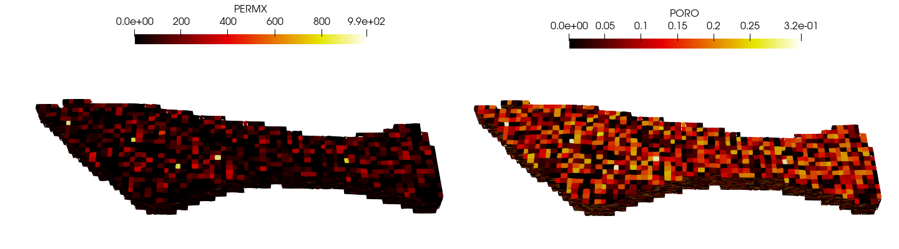

APyCE Project: A Python-based Builder/Eclipse wrapper for 3D visualization of reservoir grids
==============================================================================================
Mateus Tosta (mateustosta@outlook.com.br), Petroleum Engineering Modelling Laboratory, Federal University of Paraíba, João Pessoa, BR

<p align="center">
  
</p>

This project is intended to develop an open-source Python implementation focused on post-processing 3D reservoir grid files for integration between the softwares CMG Builder and Schlumberger Eclipse

## Installation
#### Linux
To setup the development environment do the following:

    git clone https://github.com/mateustosta/apyce-project.git
    cd apyce-project
    virtualenv --python=python3 venv3
    source venv3/bin/activate
    pip install -r requirements.txt

or, use Anaconda (https://www.anaconda.com/download/):  

    conda create -n apyce
    activate apyce
    conda install numpy vtk
   
#### Windows
Use Anaconda (https://www.anaconda.com/download/)  

    conda create -n apyce
    activate apyce
    conda install numpy vtk
    
## Usage Linux
```python
from APyCE import Model

G = Model('./Data/PSY.grdecl', 'Eclipse')
G.process_grdecl()
G.write_vtk()
```

## Usage Windows
```python
from APyCE import Model

G = Model('.\\Data\\PSY.grdecl', 'Eclipse')
G.process_grdecl()
G.write_vtk()
```

## License

This code is released under the terms of the BSD license, and thus free for commercial and research use. Feel free to use the code into your own project with a PROPER REFERENCE.  

Mateus Tosta, APyCE Project: A Python-based Builder/Eclipse wrapper for 3D visualization of reservoir grids, (2020), GitHub repository, https://github.com/mateustosta/apyce-project
    
