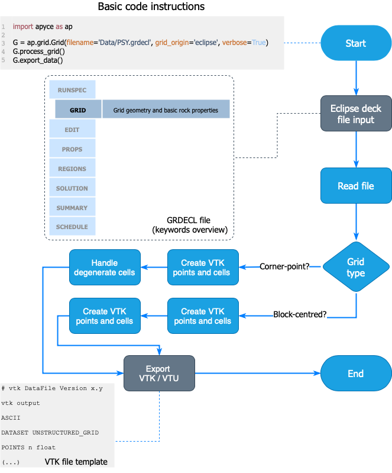

# Summary

Data visualization resources are indispensable for any software intended to handle 3D models of 
oil and gas (O\&G) reservoirs [@fanchi2005]. As never seen before, the groundbreaking power of 
computer graphics and scientific visualization have brought endless capabilities for geoscientists, 
engineers, and analysts to understand subsurface phenomena. Multidimensional views greatly improve 
seismic interpretation, reservoir characterization, and real-time monitoring of producing fields, 
since high-resolution images and 3D models can reconstitute the physical world almost perfectly. 

Many simulators with popularity among the O\&G community use discrete formulations based on 
corner-point grids [@ponting1989corner]. Corner-point grids can be considered an international 
standard to represent all the geologic features found in complex reservoirs, including dips, bends, 
pinches, and faults. While many tools for post-processing of corner-point grids are available, most 
of them are independent and have their own internal semantic and object hierarchy, which prevents their 
full integration. Furthermore, because the interoperability of grid files (in terms of importing/exporting data) 
among such programs depends on complex programming routines, the representation of modeling entities and 
features from a given software may be mismatched when read into another. Data integration and data 
visualization are permanent challenges for software and algorithm developers working on solutions for the 
O\&G sector. In particular, researchers often need visualization tools to communicate their discoveries, 
make reports with interactive plots, and easily generate publication-ready graphics of post-processed data.

A considerable number of commercial and open-source software capable to deal with corner-point grids for 
visualization purposes are known. Either they have embedded viewers as secondary functionality or are 
primarily tailored for visualization. In the first group, we can cite CMG Results©, 
Schlumberger Petrel©, ESSS Kraken©, and Amarile RE-Studio©; 
in the second group, SINTEF's MRST [@knut2019] and Ceetron Solution's ResInsight are a few options. 
Minor open-source software projects have been proposed by scholars and independent scientists with an 
interest in O\&G data, but they are usually focused on flow simulations instead of visualization and
corner-point grid manipulation. 

This paper introduces a lightweight Python-based package for the plotting of reservoir models discretized 
through Cartesian or corner-point grids called _APyCE_. The objective of this software is to provide 
a simple pipeline for post-processing through the PyVista module [@pyvista] and VTK [@vtk2010] exporting for 
3D visualization inside Kitware Paraview [@paraview2015]. 

# Statement of need

_APyCE_ (pronounced as "ah-pees") is an enhanced and extended version of the early project PyGRDECL [@pygrdecl], 
developed to handle Schlumberger Eclipse© [@Eclipse] deck files for visualization. APyCE is multi-platform, 
object-oriented, and easy to use, being prepared to fulfill its objectives with only 4 lines of Python code 
to be run by whoever with a minimum background in programming. It is recommended for researchers who need to 
render high-quality figures for inclusion into scientific papers, reports, presentations, handouts, interactive 
notebooks, and general documents for teaching purposes, or auxiliary tools for data analysis within reservoir 
modeling or related domains. 

APyCE was developed to allow quick analysis and visualization of 3D oil and gas reservoirs, so that the tool can 
be used by people in academia or industry. It is an open-source tool maintained on GitHub platform, fully accessible 
to any developer interested to contribute via pull requests. Given its object-oriented structure, the code can be 
extended and improved for further applications.

# Design and implementation

APyCE is developed on top of Eclipse deck files' structure [@pettersen2006]. However, one should stress that similar 
topologies are found in most of the input files managed by competing software. Such files are internally divided into sections. 
Each section admits a broad set of keywords that reflect the model's complexity. The higher is the number of keywords 
to be processed, the greater is the level of details on stratigraphy, fluid properties, well control, numerical settings, and so on. 

In particular, Eclipse's more general files that contain grid specifications have a `.GRDECL` extension. Initially, 
we implemented a parser routine that recognizes only the essential keywords to build either a corner-point
(\autoref{fig:cpg}) or block-centered grid (\autoref{fig:blocks}). All keywords of the file are 
identified by a regular expression like `^[A-Z][A-Z0-9]{0,7}` (\autoref{fig:grdecl}).

![Corner-point grid. This geometry enables us to describe reservoirs with geological realism. 
Sometimes referred to as "pillar grid" because of ensembles of pillars that span from the top to 
the bottom of the model, their grid cells are defined by eight paired nodes encountered over four adjacent pillars. 
Since the nodes are free to slide along the pillars, several features, such as pinch-outs and folds, 
are accurately and consistently represented, even with degenerated or nonconform cells.\label{fig:cpg}](cpg.png)

APyCE is developed under a object-oriented paradigm. It has a main class called `Grid` where the main methods are contained.
A second class called `VTK` comprises all the methods related to exporting operations of VTK files. 
The third class, `Errors`, handles error messages. However, the essential functions to load and visualize 
a reservoir grid of which any user of APyCE will mostly need are included in the former class. 

APyCE's workflow, in short, receives a deck-like Eclipse/Builder file and outputs a VTU-like file. 
After creating the VTK points, the software will retrieve the cells that follow the VTK pattern by dealing with
hexahedral objects, as this pattern is different from the one followed by the Eclipse software.
Then, by simply calling the `export_data` function, the VTK file will be exported for later exhibition 
in the Paraview software. 

APyCE's current version supports the following keywords (those marked with an asterisk are special add-on features not present in PyGRDECL):

-  _SPECGRID_: specifies the number of cells in each direction of a corner-point grid.
-  _DIMENS_: ditto for block-centered grids.
-  _COORD_: specifies the 3D coordinates of the pillars.
-  _ZCORN_: indicates the depth of each cell corner over the pillars.
-  _PORO_: stores the porosity values per cell.
-  _PERMX_: stores the X-direction permeability for each grid cell. 
-  _PERMY_: ditto for the Y-direction.
-  _PERMZ_: ditto for the Z-direction.
-  _DX_: specifies the step size over the X-direction for block-centered grids. 
-  _DY_: ditto Y-direction.
-  _DZ_: ditto Z-direction.
-  _TOPS_: stores the reference value from the top for each cell in a block-centered grid.
-  _INCLUDE_*: appends supplementary files to the main file.
-  _ACTNUM_*: tags grid cells as active/inactive (boolean value).

The example script `Getting_Started.py`, which basically reproduces the basic code instructions
(see \autoref{fig:workflow}) generates multiple VTK file, which can be visually improved from 
Paraview as depicted in the showcase (\autoref{fig:showcase}).

## Additional information
APyCE was written in Python 3.8. The choice for this language is justified by the vast amount of modules available
to perform scientific computing, signal processing, and graphic manipulation tasks. Another point that strengthens
the choice for Python is its simplicity, which reduces software maintenance. Through the available modules and packages,
modularized programming and code reuse is encouraged.

As for processing, highly refined grids (hundreds or millions of cells) may demand a robust hardware ensemble (RAM and processor). Yet less complex grids are manageable affordably. Also, to work properly, APyCE requires the following Python packages:
`NumPy` (v. 1.19.2 or above), `VTK` (v. 8.2.0 or above), `PyVista` (v. 0.29 or above), and `Matplotlib` (v. 3.4.1 or above).

The most current version was tested on Ubuntu 20.04 distribution with the 5.11.0-25-generic kernel anw with `PyTest` [@pytest]. 
All the workflow for exporting/visualizing corner-point grids are fully workable, but block-centered grids still have 
partial keyword support.

## Acknowledgments

G.P.O. and M.T. acknowledge the funding received by the National Council for Scientific and Technological Development (CNPq-Brazil)
under the PIBIC/UFPB Program 2020-2021, grant no. PVL11528-2020.

# References